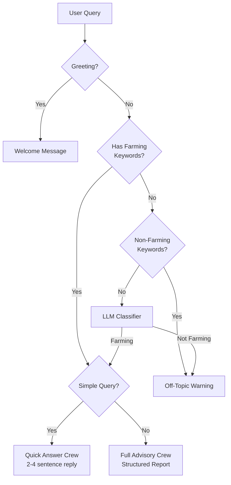
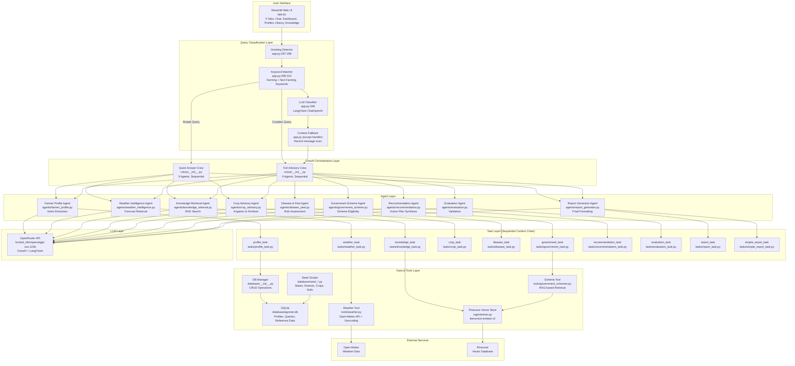
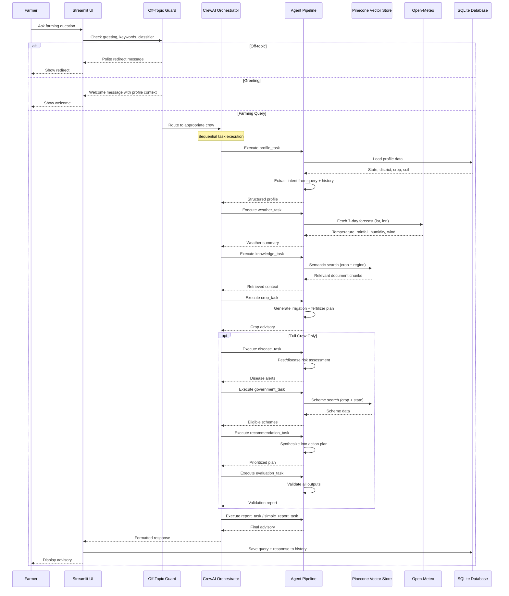
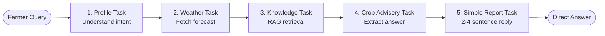

# AgroNet System Architecture

## Overview

AgroNet is an AI-powered multi-agent crop advisory system for Indian agriculture. It uses a **CrewAI sequential orchestration layer** to understand farmer queries, retrieve contextual knowledge from RAG and live weather APIs, reason across specialized agents, and generate evidence-based advisory reports.

The system provides one primary interface:
- **Streamlit Web UI** — multi-tab dashboard with Chat, Dashboard, Profiles, History, and Knowledge tabs

Data is stored in a **SQLite database** with farmer profiles, query history, and seeded reference data (states, districts, crops, soil types). Unstructured agricultural knowledge is indexed in a **Pinecone vector store** for semantic retrieval.

---

## Table of Contents

- [Key Features](#key-features)
- [System Diagram](#system-diagram)
- [Data Flow](#data-flow)
- [Crew Workflow](#crew-workflow)
- [Component Descriptions](#component-descriptions)
- [Database Schema](#database-schema)
- [RAG Architecture](#rag-architecture)
- [Dual Crew Architecture](#dual-crew-architecture)
- [Query Classification Pipeline](#query-classification-pipeline)
- [LLM Configuration](#llm-configuration)
- [Startup Behaviour](#startup-behaviour)

---

## Key Features

### Dual Crew Architecture

Two CrewAI crews handle different query complexities:

| Crew | Agents | Use Case |
|------|--------|----------|
| **Full Advisory Crew** (`agri_crew`) | 9 agents — full pipeline from profile to report | Complex queries needing comprehensive structured reports |
| **Quick Answer Crew** (`simple_crew`) | 5 agents — profile, weather, knowledge, crop, report | Simple queries (water amounts, fertilizer ratios, pest ID) |

Routing is automatic based on keyword detection in the query and conversation context.

### Off-Topic Query Guard

When a query lacks explicit farming keywords:
1. **Domain keyword check** — Quick reject if non-farming keywords detected (restaurant, movie, etc.)
2. **LLM classifier fallback** — LangChain `ChatOpenAI` call with conversation context to classify relevance
3. **Context fallback** — If LLM fails, checks if recent conversation history contains farming keywords and query is short (plausible follow-up)

### Conversation Context Passing

The last 6 messages are bundled as conversation history and injected into every task input. This enables:
- Follow-up resolution ("what about fertilizer?" → refers to previous crop)
- Pronoun resolution ("can I do it in the evening?" → refers to irrigation)
- Consistent identity across turns

### Smart Query Routing



### Season-Aware Dashboard

Dashboard components:
- **Season detector** — Automatically determines Kharif (Jun-Sep), Rabi (Oct-Mar), or Zaid (Apr-May) based on current month
- **Crop calendar** — LLM-generated sowing/harvest windows per crop and state
- **Season info** — LLM-generated crops and advisory tips per season
- **Countdown timer** — Days remaining until current season ends

---

## System Diagram



---

## Data Flow



---

## Crew Workflow

### Full Advisory Crew (Sequential Pipeline)

```mermaid
flowchart LR
    START([Farmer Query]) --> P[1. Profile Task<br>Understand intent]
    P --> W[2. Weather Task<br>Fetch forecast]
    W --> K[3. Knowledge Task<br>RAG retrieval]
    K --> C[4. Crop Advisory Task<br>Irrigation & Fertilizer]
    C --> D[5. Disease & Pest Task<br>Risk assessment]
    D --> G[6. Government Scheme Task<br>Eligibility]
    G --> R[7. Recommendation Task<br>Action plan]
    R --> E[8. Evaluation Task<br>Validation]
    E --> REP[9. Report Task<br>Format output]
    REP --> END([Structured Advisory Report])
```



### Quick Answer Crew (Concise Pipeline)



### Task Context Dependencies

Each task receives outputs from upstream tasks as context:

| Task | Context From | Passes To |
|------|-------------|-----------|
| `profile_task` | — (inputs only) | weather, knowledge, crop |
| `weather_task` | profile_task | crop, disease, recommendation |
| `knowledge_task` | profile_task | recommendation |
| `crop_task` | profile_task, weather_task | disease, recommendation |
| `disease_task` | profile_task, weather_task | recommendation |
| `government_task` | profile_task | recommendation |
| `recommendation_task` | profile, weather, knowledge, crop, disease, government | evaluation |
| `evaluation_task` | recommendation_task | report |
| `report_task` | profile, weather, knowledge, crop, disease, government, recommendation, evaluation | — |
| `simple_report_task` | profile, weather, knowledge, crop | — |

---

## Component Descriptions

### Entry Points

| Component | File | Responsibility |
|-----------|------|----------------|
| Web UI | `app.py` | Streamlit multi-tab interface: Chat, Dashboard, Profiles, History, Knowledge |
| Config | `config/__init__.py` | Environment variable loading, API key validation, constants |
| LLM Factory | `config/llm.py` | CrewAI LLM creation with hosted_vllm prefix routing |

### Agent Layer

| Component | File | Responsibility |
|-----------|------|----------------|
| Farmer Profile Agent | `agents/farmer_profile.py` | Intent extraction, conversation context understanding |
| Weather Intelligence Agent | `agents/weather_intelligence.py` | 7-day weather forecast retrieval via Open-Meteo |
| Knowledge Retrieval Agent | `agents/knowledge_retrieval.py` | Semantic search over agricultural PDFs via Pinecone |
| Crop Advisory Agent | `agents/crop_advisory.py` | Irrigation schedule, fertilizer rates, management practices |
| Disease & Pest Agent | `agents/disease_pest.py` | Pest alerts, disease risk levels, treatment recommendations |
| Government Scheme Agent | `agents/government_scheme.py` | Scheme eligibility lookup from RAG knowledge base |
| Recommendation Agent | `agents/recommendation.py` | Priority-ranked action plan synthesis |
| Evaluation Agent | `agents/evaluation.py` | Validation of accuracy, consistency, safety |
| Report Generator Agent | `agents/report_generator.py` | Final output formatting (structured report or concise answer) |

### Task Layer

| Component | File | Responsibility |
|-----------|------|----------------|
| Profile Task | `tasks/profile_task.py` | Structured farmer profile with Pydantic output schema |
| Weather Task | `tasks/weather_task.py` | Weather summary extraction from API response |
| Knowledge Task | `tasks/knowledge_task.py` | RAG query with crop + state + district context |
| Crop Task | `tasks/crop_task.py` | Irrigation and fertilizer recommendation generation |
| Disease Task | `tasks/disease_task.py` | Pest and disease risk assessment with thresholds |
| Government Task | `tasks/government_task.py` | Government scheme matching and application guidance |
| Recommendation Task | `tasks/recommendation_task.py` | Consolidated prioritized action plan |
| Evaluation Task | `tasks/evaluation_task.py` | Validation report with confidence levels |
| Report Task | `tasks/report_task.py` | 8-section structured advisory report |
| Simple Report Task | `tasks/simple_report_task.py` | 2-4 sentence direct answer |

### Data Layer

| Component | File | Responsibility |
|-----------|------|----------------|
| DB Manager | `database/__init__.py` | SQLite connection, CRUD for profiles, queries, reference data |
| States Seed | `database/seed_states.py` | 36 Indian states and union territories |
| Districts Seed | `database/seed_districts.py` | District data per state |
| Crops Seed | `database/seed_crops.py` | Crop types and commodities with cascading dropdown |
| Soils Seed | `database/seed_soils.py` | Soil type reference data |
| RAG Retriever | `rag/retriever.py` | Pinecone vector store, BM25 keyword index, hybrid RRF fusion, embedding, ingestion |

### Tools

| Component | File | Responsibility |
|-----------|------|----------------|
| Weather Tool | `tools/weather.py` | Open-Meteo API integration, geocoding, 7-day forecast |
| Gov Scheme Tool | `tools/government_schemes.py` | RAG-based government scheme retrieval and parsing |

### Configuration

| Component | File | Responsibility |
|-----------|------|----------------|
| Settings | `config/__init__.py` | Environment config, API keys, constants |
| LLM Config | `config/llm.py` | CrewAI LLM factory with hosted_vllm/ prefix auto-insertion |
| Logger | `utils/logging_config.py` | Centralized logging (console INFO + file DEBUG) |

---

## Database Schema

AgroNet uses a SQLite database (`database/agronet.db`) with the following tables:

| Table | Description |
|-------|-------------|
| `farmer_profiles` | Farm profiles with name, state, district, crop, soil_type, timestamps |
| `queries` | Query history with profile foreign key, question text, response text, timestamps |
| `states` | 36 Indian states and union territories (seeded) |
| `districts` | Districts per state with foreign key to states (seeded) |
| `commodities` | Crop types and crop names with cascading type → name hierarchy (seeded) |
| `soils` | Soil type reference data (seeded) |

### Key Relationships

```
farmer_profiles ──1:N── queries
states ──1:N── districts
```

### Seed Data

- **36** states and union territories
- **700+** districts across all states
- **200+** commodities grouped by type (Cereals, Pulses, Oilseeds, Vegetables, Fruits, etc.)
- **20+** soil types (Alluvial, Black, Red, Laterite, Sandy, Clay, Loamy, etc.)

---

## RAG Architecture

AgroNet uses hybrid search combining Pinecone vector search with BM25 keyword search and Reciprocal Rank Fusion (RRF).

### How It Works

1. **Indexing** — PDFs in `data/` are parsed by LlamaIndex's `SimpleDirectoryReader`, chunked by `SentenceSplitter` (512 tokens, 50 overlap). Each chunk is embedded via Pinecone's `llama-text-embed-v2` API in batches of 10 and upserted directly to the Pinecone index with progress logging. The same chunks are saved to `data/_chunks.json` for the BM25 corpus.
2. **Vector Retrieval** — Knowledge Retrieval Agent embeds the farmer's query using the same embedding model and searches the Pinecone index with cosine similarity (top-10 results).
3. **Keyword Retrieval** — The query is tokenized and scored against the BM25 in-memory index built from the same chunk corpus (top-10 results).
4. **Fusion** — Both result sets are merged using Reciprocal Rank Fusion (RRF, k=60):
   ```
   score(chunk) = Σ 1 / (k + rank_i)   for each system that returned the chunk
   ```
   The top-5 chunks by RRF score are returned.
5. **Augmentation** — Fused chunks are injected into the LLM context for grounded response generation.

### Architecture

```
PDF Documents (data/*.pdf)
    │
    ▼
SimpleDirectoryReader
    │
    ▼
SentenceSplitter (chunk=512, overlap=50)
    │
    ├──► Pinecone Embedding (llama-text-embed-v2)
    │       │
    │       ▼
    │   Pinecone Vector Index (cosine, dimension=1024)
    │       │
    │       ▼
    │   Top-10 Vector Results
    │
    └──► data/_chunks.json
            │
            ▼
        BM25 In-Memory Index
            │
            ▼
        Top-10 Keyword Results

                            ▼
              Reciprocal Rank Fusion (k=60)
                            │
                            ▼
                    Top-5 Fused Chunks
                            │
                            ▼
                       LLM Context
```

### RRF Scoring

```
score(chunk) = 1/(60 + rank_vector) + 1/(60 + rank_bm25)

If a chunk appears in both results, it gets a boost from both systems.
If it appears in only one, it gets a single contribution.
```

### Indexed Data Sources

| Source | Content Type |
|--------|-------------|
| ICAR Crop Production Guides | Cultivation practices, variety recommendations |
| TNAU Extension Publications | Regional best practices, pest management |
| Ministry of Agriculture Guidelines | Policy documents, scheme details |
| Krishi Vigyan Kendra Advisories | Localized farming advisories |
| PM-KISAN / PMFBY Guidelines | Scheme eligibility, application procedures |
| Fertilizer Recommendation Manuals | NPK ratios, application rates |
| Integrated Pest Management Docs | Biological control, threshold levels |

### Ingestion Lifecycle

- **File-hash tracking** — On startup, SHA256 hashes of all PDFs in `data/` are computed and compared against `data/_file_hashes.json`
- **No changes** → Skip ingestion entirely, load existing Pinecone index and BM25
- **New/modified PDFs detected** → Full re-ingestion (chunk → batch embed → batch upsert) with per-batch progress; hashes saved afterward
- **Manual re-ingest**: Delete `data/_file_hashes.json` or clear Pinecone index

---

## Dual Crew Architecture

### Crew Selection Logic

```
Query
    │
    ├─► Contains simple keywords? (water, fertilizer, pest, rain, when to, npk, etc.)
    │       └─► simple_crew (Quick Answer)
    │
    └─► No simple keywords in query BUT in conversation context?
    │       └─► simple_crew (Quick Answer, follow-up)
    │
    └─► Complex/multi-part query?
            └─► agri_crew (Full Advisory)
```

### Full Advisory Crew (`agri_crew`)

- **9 agents** in sequential pipeline
- **9 tasks** with context chaining
- Produces structured 8-section advisory report
- Includes disease, government schemes, evaluation

### Quick Answer Crew (`simple_crew`)

- **5 agents** (Profile, Weather, Knowledge, Crop, Report)
- **5 tasks** with minimal context
- Produces 2-4 sentence direct answer
- No disease, schemes, recommendation, or evaluation stages
- Designed for low-latency responses to simple queries

---

## Query Classification Pipeline

```mermaid
flowchart TD
    Q[User Query] --> G{In greetings set?}
    G -->|Yes| WELCOME[Show Welcome Message]
    G -->|No| K{Contains farming<br>keywords?}
    K -->|Yes| FARM[is_farming = True]
    K -->|No| NF{Contains non-farming<br>keywords?}
    NF -->|Yes| REJECT[Off-Topic Warning]
    NF -->|No| LLM[Call LLM Classifier<br>with conversation context]
    LLM -->|Yes| FARM
    LLM -->|Exception| FALLBACK[Context Fallback<br>Recent msgs have farming keywords<br>AND query < 50 chars?]
    FALLBACK -->|Yes| FARM
    FALLBACK -->|No| REJECT
    FARM -->{Simple keywords<br>in query or context?}
    FARM -->|Yes| SIMPLE[Simple Crew]
    FARM -->|No| FULL[Full Crew]
```

### Classification Triggers

| Pattern | Action |
|---------|--------|
| Query contains `farming_keywords` match | `is_farming = True` |
| Query contains `non_farming_keywords` match | `is_farming = False` (skip LLM) |
| No keywords matched | LLM classifier with conversation context |
| LLM says "yes" | `is_farming = True` |
| LLM fails | Context fallback: recent msgs have farming keywords AND query < 50 chars |
| `is_farming = True` + simple keywords | `simple_crew` (quick answer) |
| `is_farming = True` + no simple keywords | `agri_crew` (full report) |

```python
# Keyword sets (app.py)
farming_keywords = ["crop", "water", "fertilizer", "pest", "disease", "irrigation", ...]
non_farming_keywords = ["restaurant", "movie", "music", "car", "phone", ...]
simple_kw = ["water", "irrigation", "how much", "fertilizer", "npk", "pest", ...]
```

---

## LLM Configuration

### Provider Routing

CrewAI 1.15.1 routes model names differently based on prefix:

| Prefix | Provider Used | Behavior |
|--------|--------------|----------|
| `openai/` | `OpenAICompletion` | Strips prefix → sends bare model name to API |
| `hosted_vllm/` | `OpenAICompatibleCompletion` | Preserves full model name in API request |
| `openrouter/` | OpenRouter provider | Triggers OpenRouter-specific headers/config |

**Solution**: Models with `/` in name automatically get `hosted_vllm/` prefix to force correct provider routing through OpenRouter.

```python
# config/llm.py
model_name = model or OPENROUTER_MODEL
if "/" in model_name and not model_name.startswith(("openrouter/", "hosted_vllm/")):
    model_name = f"hosted_vllm/{model_name}"
return LLM(model=model_name, temperature=temperature, api_key=..., base_url=...)
```

### Environment Variables

| Variable | Value (current) |
|----------|----------------|
| `PINECONE_API_KEY` | `pcsk_31t...` |
| `PINECONE_INDEX_NAME` | `agronet` |
| `PINECONE_EMBEDDING_MODEL` | `llama-text-embed-v2` |
| `PINECONE_EMBEDDING_DIM` | `1024` |
| `OPENROUTER_API_KEY` | `nvapi-...` / `sk-or-v1-...` |
| `OPENROUTER_BASE_URL` | `https://integrate.api.nvidia.com/v1` |
| `OPENROUTER_MODEL` | `openai/gpt-oss-120b` |
| `CREWAI_TRACING_ENABLED` | `true` |
| `WEATHER_API_BASE` | `https://api.open-meteo.com/v1/forecast` |

### LangChain Calls (Dashboard Widgets)

Separate from CrewAI, LangChain `ChatOpenAI` calls power:

| Call | Purpose | Max Tokens |
|------|---------|------------|
| `_fetch_crop_cal()` | Generate sowing/harvest calendar for dashboard | Unlimited |
| `_fetch_season_info()` | Generate season crops and advisory for dashboard | Unlimited |
| Off-topic classifier | Classify query relevance | 10 |

These use `os.getenv()` directly for model, API key, and base URL — bypassing the CrewAI LLM factory.

---

## Startup Behaviour

On application launch:

1. **Telemetry disabled** — `CREWAI_DISABLE_TELEMETRY` is set to `"true"` before any CrewAI imports
2. **Environment loaded** — `dotenv.load_dotenv()` reads `.env` file
3. **Tracing configured** — If `CREWAI_TRACING_ENABLED=true` in `.env`, the env var is set for CrewAI
4. **Database initialized** — `init_db()` creates tables if missing, adds missing columns via migration
5. **RAG auto-ingested** — `auto_ingest_if_needed()` compares PDF file hashes against stored hashes; ingests only if files changed
6. **Profile loaded** — If profiles exist, first profile is auto-selected as active
7. **LLM configured** — CrewAI agents use `get_llm()` factory; LangChain calls use env vars directly
8. **Dashboard cached** — Season info and crop calendar are fetched on first dashboard view and cached in session state per crop+state combination

---

## Limitations

### API Rate Limits
The system relies on external LLM API rate limits — requests may queue or time out under heavy concurrent load.

### Model Latency
Large reasoning models (300B+ parameters) add 10-30s per agent call. With 9 agents running sequentially, a full advisory report can take 2-5 minutes.

### RAG Dependency
Without PDF documents in `data/`, the knowledge retrieval agent returns no context, reducing response quality. Government scheme lookup also depends on indexed scheme documents.

### Weather Data
Open-Meteo provides forecasts with ~2km resolution, but doesn't include historical data or advanced agro-climatic indices used in precision farming.
